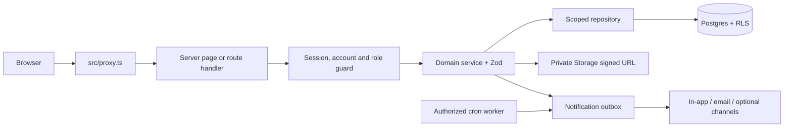

# Architecture and Data Flow

## Runtime

The application uses Next.js 16 App Router, React 19, TypeScript, Supabase PostgreSQL/Auth/Storage/Realtime through `@supabase/ssr`, Zod boundary validation, and OpenAI Structured Outputs for checklist and CV extraction.

The browser is untrusted. Authorization is checked at the session/account guard, route/service, repository scope, RPC, RLS, and Storage-policy boundaries. Service-role repositories derive scope from the authenticated actor because service-role access bypasses RLS.

## Placement flow

Admin approval leads to verified company/job creation, checklist draft and human approval, publication, Student application with a private CV, automated scoring, Placement HR verification, transactional Client submission, mock completion, Client decision/interviews, feedback, offer, Student decision, explicit Placement HR/Admin confirmation, and placement closure.

Material transitions write status/history or audit rows. Candidate submissions snapshot profile and score data. Automated and verified scores remain separate. Notification producers use one outbox with dedupe keys and the worker uses atomic claims.

## Identity and ownership

`profiles.id` is the Auth user ID. `student_profiles.user_id` references it, while `applications.student_id` references `student_profiles.id`. Client scope is derived through `client_hr_profiles.company_id`; Placement HR scope follows `jobs.assigned_placement_hr`.
